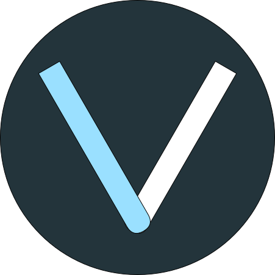

<!-- Improved compatibility of back to top link: See: https://github.com/othneildrew/Best-README-Template/pull/73 -->
<a name="readme-top"></a>
<!--
*** Thanks for checking out the Best-README-Template. If you have a suggestion
*** that would make this better, please fork the repo and create a pull request
*** or simply open an issue with the tag "enhancement".
*** Don't forget to give the project a star!
*** Thanks again! Now go create something AMAZING! :D
-->


<!-- PROJECT SHIELDS -->
<!--
*** I'm using markdown "reference style" links for readability.
*** Reference links are enclosed in brackets [ ] instead of parentheses ( ).
*** See the bottom of this document for the declaration of the reference variables
*** for contributors-url, forks-url, etc. This is an optional, concise syntax you may use.
*** https://www.markdownguide.org/basic-syntax/#reference-style-links
-->
<!-- PROJECT LOGO -->
<br />
<div align="center">
  <a href="https://vass.dmacha.dev">
    
  </a>

  <h1 align="center">VASS</h1>
  <h3 align="center">Visualizador de algoritmos Semi-Supervisados</h3>

[](https://sonarcloud.io/summary/new_code?id=dma1004_TFG-SemiSupervisado)
[](https://sonarcloud.io/summary/new_code?id=dma1004_TFG-SemiSupervisado)
[](https://sonarcloud.io/summary/new_code?id=dma1004_TFG-SemiSupervisado)
[](https://sonarcloud.io/summary/new_code?id=dma1004_TFG-SemiSupervisado)
[](https://sonarcloud.io/summary/new_code?id=dma1004_TFG-SemiSupervisado)
[](https://sonarcloud.io/summary/new_code?id=dma1004_TFG-SemiSupervisado)
[](https://sonarcloud.io/summary/new_code?id=dma1004_TFG-SemiSupervisado)

  <p align="center">
    <a href="https://github.com/dma1004/TFG-SemiSupervisado/tree/main/doc"><strong>Documentación »</strong></a>
    <br />
    <br />
    <a href="https://vass.dmacha.dev">Ver en directo</a>
    ·
    <a href="https://github.com/dma1004/TFG-SemiSupervisado/issues">Reportar un Bug</a>
    ·
    <a href="https://github.com/dma1004/TFG-SemiSupervisado/issues">Solicitar nueva característica</a>
  </p>
</div>


<!-- TABLE OF CONTENTS -->
<details>
  <summary>Contenido</summary>
  <ol>
    <li>
      <a href="#objetivo">Objetivo</a>
      <ul>
        <li><a href="#tecnologías">Tecnologías</a></li>
      </ul>
    </li>
    <li>
      <a href="#comenzando">Comenzando</a>
      <ul>
        <li><a href="#prerrequisitos">Prerrequisitos</a></li>
        <li><a href="#instalación">Instalación</a></li>
      </ul>
    </li>
    <li><a href="#uso">Uso</a></li>
    <li><a href="#roadmap">Roadmap</a></li>
    <li><a href="#licencia">Licencia</a></li>
    <li><a href="#contacto">Contacto</a></li>
    <li><a href="#recursos-útiles">Recursos útiles</a></li>
  </ol>
</details>


<!-- ABOUT THE PROJECT -->
## Objetivo

Trabajo Fin de Grado sobre aprendizaje semi-supervisado aplicado como herramienta de docencia. El objetivo es la visualización de los principales algoritmos de este ámbito para trastear con ellos y ayudar a entenderlos.

<p align="right">(<a href="#readme-top">volver al principio</a>)</p>


### Tecnologías

Tecnologías usadas para la creación de VASS:

* [![Python][Python.io]][Python-url]
* [![Flask][FLASK.io]][FLASK-url]
* [![HTML5][HTML.io]][HTML-url]
* [![CSS3][CSS.io]][CSS-url]
* [![Bootstrap][Bootstrap.com]][Bootstrap-url]
* [![JavaScript][JavaScript.io]][JavaScript-url]

<p align="right">(<a href="#readme-top">volver al principio</a>)</p>


<!-- GETTING STARTED -->
## Comenzando

### Prerrequisitos

Instalación de Python 3.10.
* Python
  ```
    sudo apt install python3.10  
  ```

### Instalación

Principalmente para un entorno Linux:

1. Clonar el repositorio
   ```sh
   git clone https://github.com/dma1004/TFG-SemiSupervisado.git
   ```
2. Crear entorno virtual
   ```sh
   cd TFG-SemiSupervisado
   
   python -m venv ./venv
   ```
4. Activar entorno virtual
   ```sh
   source venv/bin/activate
   ```
5. Instalar dependencias
   ```sh
   pip install -r requirements.txt

   pip install .  #paquetes locales
   ```
6. Creación de directorios
   ```sh
   cd web/app
   
   mkdir runs
   
   mkdir datasets/anonimos
   
   mkdir datasets/registrados
   ```
6. Compilar traducciones (web/app)
   ```sh
   pybabel compile -d translations
   ```
7. Ejecución
   ```sh
   cd ..   #(/web)

   flask run
   ```

<p align="right">(<a href="#readme-top">volver al principio</a>)</p>


<!-- USAGE EXAMPLES -->
## Uso

Para usar la aplicación solo será necesario tener un navegador (Firefox, Google Chrome, Edge...)
y acceder a [VASS](https://vass.dmacha.dev)

Un manual de usuario completo puede encontrarse en la [Documentación](https://github.com/dma1004/TFG-SemiSupervisado/tree/main/doc/anexos.pdf).

<p align="right">(<a href="#readme-top">volver al principio</a>)</p>


<!-- ROADMAP -->
## Roadmap

- [x] Biblioteca del algoritmos personalizados
- [x] Validación de los algoritmos
- [x] Aplicación Web en funcionamiento
- [x] Visualización Self-Training
- [x] Visualización Co-Training
- [x] Visualización Democratic Co-Learning
- [x] Visualización Tri-Training
- [x] Soporte para múltiples lenguajes
    - [x] Inglés
    - [x] Español
- [x] Pruebas de sistema
- [ ] Documentación

<p align="right">(<a href="#readme-top">volver al principio</a>)</p>


<!-- LICENSE -->
## Licencia
[](https://github.com/dma1004/TFG-SemiSupervisado/blob/main/LICENSE)


<p align="right">(<a href="#readme-top">volver al principio</a>)</p>


<!-- CONTACT -->
## Contacto

David Martínez - dma1004@alu.ubu.es

Link del proyecto: [https://github.com/dma1004/TFG-SemiSupervisado](https://github.com/dma1004/TFG-SemiSupervisado)

<p align="right">(<a href="#readme-top">volver al principio</a>)</p>


<!-- ACKNOWLEDGMENTS -->
## Recursos útiles

Lista de recursos que han resultado útiles durante la realización del proyecto.

* [Stack Overflow](https://stackoverflow.com/)
* [Ejemplos D3.js](https://d3-graph-gallery.com/)
* [Más ejemplos D3.js](https://observablehq.com/@d3/gallery)
* [Codepen](https://codepen.io/)
* [Documentación Bootstrap 5](https://getbootstrap.com/docs/5.2/getting-started/introduction/)
* [Curso CSS: Soy Dalto](https://www.youtube.com/watch?v=OWKXEJN67FE)
* [Tutoriales y cursos](https://www.w3schools.com/)


<p align="right">(<a href="#readme-top">volver al principio</a>)</p>


<!-- MARKDOWN LINKS & IMAGES -->
<!-- https://www.markdownguide.org/basic-syntax/#reference-style-links -->
[contributors-shield]: https://img.shields.io/github/contributors/othneildrew/Best-README-Template.svg?style=for-the-badge
[contributors-url]: https://github.com/othneildrew/Best-README-Template/graphs/contributors
[forks-shield]: https://img.shields.io/github/forks/othneildrew/Best-README-Template.svg?style=for-the-badge
[forks-url]: https://github.com/othneildrew/Best-README-Template/network/members
[stars-shield]: https://img.shields.io/github/stars/othneildrew/Best-README-Template.svg?style=for-the-badge
[stars-url]: https://github.com/othneildrew/Best-README-Template/stargazers
[issues-shield]: https://img.shields.io/github/issues/othneildrew/Best-README-Template.svg?style=for-the-badge
[issues-url]: https://github.com/othneildrew/Best-README-Template/issues
[license-shield]: https://img.shields.io/github/license/othneildrew/Best-README-Template.svg?style=for-the-badge
[license-url]: https://github.com/othneildrew/Best-README-Template/blob/master/LICENSE.txt
[linkedin-shield]: https://img.shields.io/badge/-LinkedIn-black.svg?style=for-the-badge&logo=linkedin&colorB=555
[linkedin-url]: https://linkedin.com/in/othneildrew
[product-screenshot]: images/screenshot.png
[Bootstrap.com]: https://img.shields.io/badge/Bootstrap-563D7C?style=for-the-badge&logo=bootstrap&logoColor=white
[Bootstrap-url]: https://getbootstrap.com
[Python.io]: https://img.shields.io/badge/Python-3776AB?style=for-the-badge&logo=python&logoColor=white
[Python-url]: https://www.python.org/
[JavaScript.io]: https://img.shields.io/badge/JavaScript-F7DF1E?style=for-the-badge&logo=javascript&logoColor=black
[JavaScript-url]: https://www.javascript.com/
[HTML.io]: https://img.shields.io/badge/HTML5-E34F26?style=for-the-badge&logo=html5&logoColor=white
[HTML-url]: https://html.com/
[CSS.io]: https://img.shields.io/badge/CSS3-1572B6?style=for-the-badge&logo=css3&logoColor=white
[CSS-url]: https://www.css3.com/
[FLASK.io]: https://img.shields.io/badge/Flask-000000?style=for-the-badge&logo=flask&logoColor=white
[FLASK-url]: https://flask.palletsprojects.com/en/2.3.x/